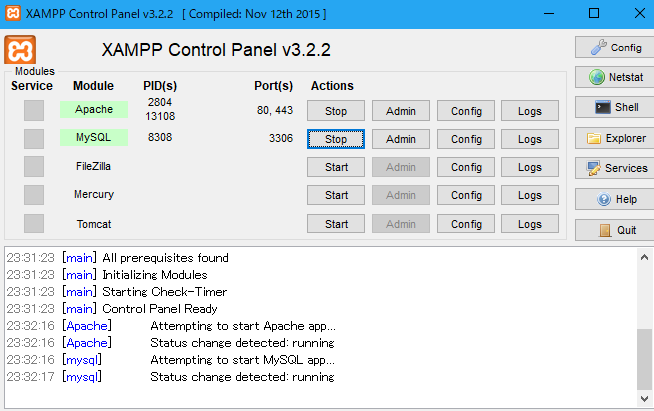
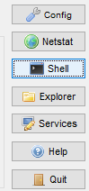
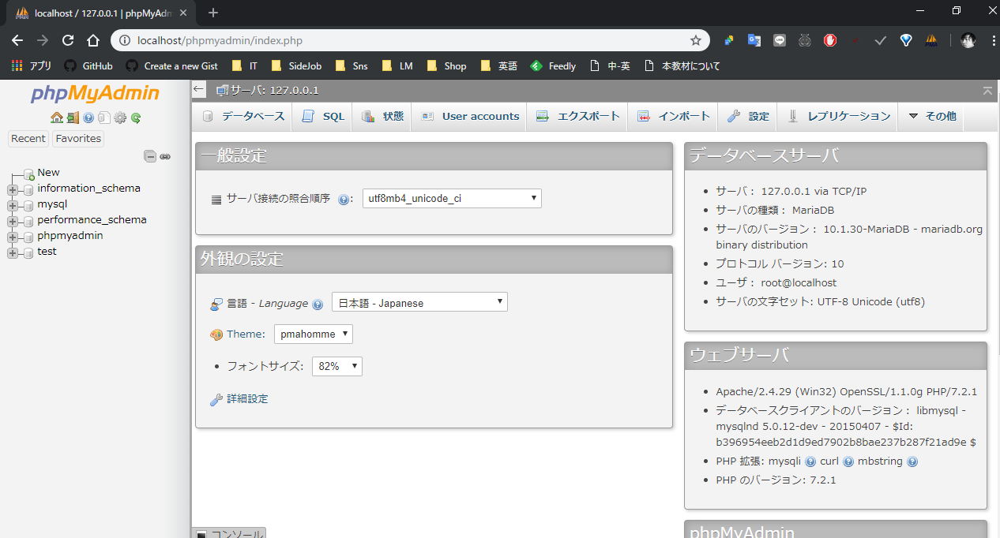
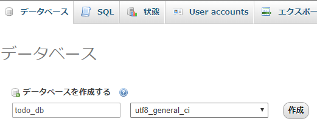

# SQLの記述

ここでは、PhpMyAdminを利用して実際にSQLを書きながら基本的なSQLを説明していきます。

## 準備
XAMPPのコントロールを立ち上げ、ApacheとMySQLを起動してください。



Shellを立ち上げる



MySQLの初期パスワードを設定する

```bash
## MySQLへフォルダ変更
cd mysql\bin

## MySQLへログイン
mysqladmin -u root password

## パスワードを設定する
New password: ********
Confirm new password: ********
```

下記ファイルの２１行あたりにMySQLのパスワードを記述する
- C:\xampp\phpMyAdmin\config.inc.php
  ```php
  $cfg['Servers'][$i]['password'] = '設定したパスワード';
  ```

MySQLのAdminを起動




データベースタブで「todo_db」というデータベースを新規作成する



## CREATE TABLE

SQLタブで以下のSQLを書いて、実行ボタンを押してください。

```sql
CREATE TABLE todo_user (
  id int not null primary key,
  name varchar(50) not null,
  password char(25) not null
  )
```

## INSERT

SQLタブで以下のSQLを書いて、実行ボタンを押してください。

```sql
INSERT INTO TODO_USER(ID, NAME, PASSWORD)
VALUES(1, 'テスト1', 'TEST1PASSWORD');

INSERT INTO TODO_USER(ID, NAME, PASSWORD)
VALUES(2, 'テスト2', 'TEST2PASSWORD')
```

## INSERT

SQLタブで以下のSQLを書いて、実行ボタンを押してください。

```sql
INSERT INTO TODO_USER(ID, NAME, PASSWORD)
VALUES(1, 'テスト1', 'TEST1PASSWORD')
```

## UPDATE

SQLタブで以下のSQLを書いて、実行ボタンを押してください。

```sql
UPDATE
    TODO_USER
SET NAME
    = 'てすと1'
WHERE
    ID = 1
```

## DELETE文

SQLタブで以下のSQLを書いて、実行ボタンを押してください。

```sql
DELETE
FROM
    TODO_USER
WHERE
    ID = 2
```