# JavaからMySQLへの接続

Javaプログラムからデータベースに対してアクセスするためには、 JDBC を利用します。
JDBCとは、Javaからデータベースに対してアクセスするための標準APIです。

## プロジェクトを作成

IntelliJを立ち上げ、新規プロジェクトを作成する。

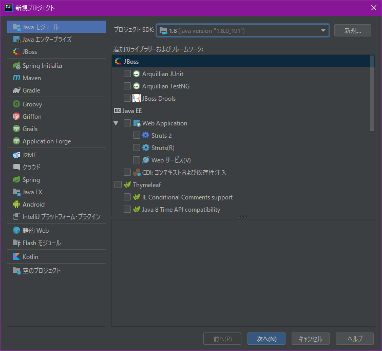

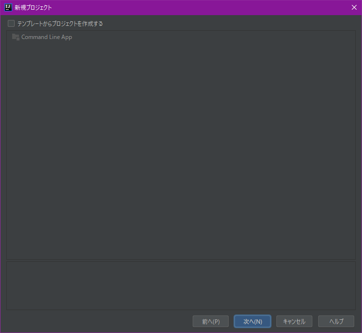

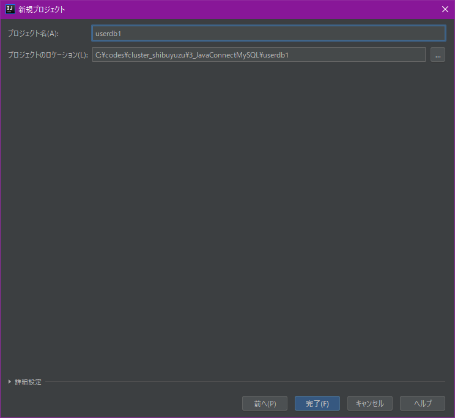

## JDBC参照の追加

下記から演習用に用意したjarファイルをダウンロードし、ローカルに保存する。

[MySQL接続JDBC](https://github.com/dongsu-iis/cluster_shibuyuzu/blob/master/Tools/mysql-connector-java-8.0.13.jar)

ファイル→プロジェクトの構成を立ち上げる

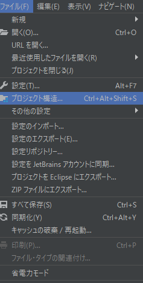

モジュール→依存関係まで移動

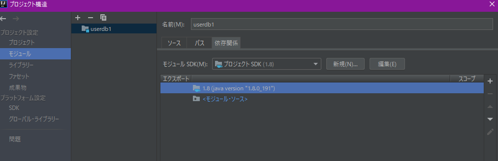

＋マークからJarファイル追加を選択

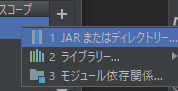

さきほどダウンロードしたjarファイルを選択して、OK

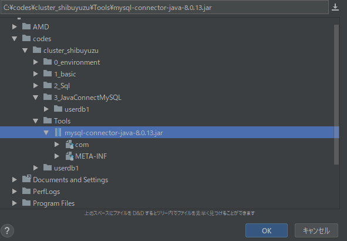

外部ライブラリが追加されたことを確認

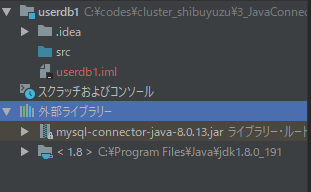

## Java作成

新規にJavaクラスを作成

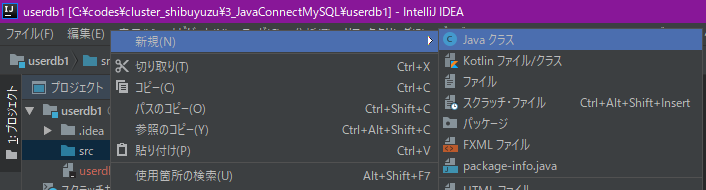

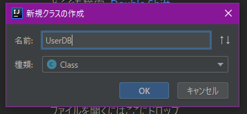

冒頭に参照するコードを追加する

```Java
import java.sql.Connection;
import java.sql.DriverManager;
import java.sql.ResultSet;
import java.sql.SQLException;
import java.sql.Statement;
```

ローカル変数宣言

```java
private static final String _tableName = "todo_user";
private Connection _connection;
private Statement _statement;
```

コンストラクタ

```java
    public UserDB() {
        _connection = null;
        _statement = null;
    }
```

JDBD接続を初期化するコードを定義
MySQLのパスワードは自分で設定したもの

```java
    public void open() throws ClassNotFoundException, SQLException {
        Class.forName("com.mysql.jdbc.Driver");
        _connection = DriverManager.getConnection("jdbc:mysql://localhost:3306/todo_db?characterEncoding=UTF-8&serverTimezone=JST",
                "root", "password");
        _statement = _connection.createStatement();
    }
```

コネクション破棄

```java
    public void close()  {
        if(_statement != null) {
            try{
                _statement.close();
            }catch(SQLException e) {
            }
            _statement = null;
        }
        
        if(_connection != null) {
            try{
                _connection.close();
            }catch(SQLException e) {
            }
            _connection = null;
        }
    }
```

SELECT

```java
    private void executeSelect() throws SQLException {
        ResultSet resultSet = _statement.executeQuery("SELECT * FROM " + _tableName);
        try {
            boolean br = resultSet.first();
            if (br == false) {
                return;
            }
            do {
                Integer id = resultSet.getInt("ID");
                String name = resultSet.getString("NAME");
                String password = resultSet.getString("PASSWORD");

                System.out.println("id: " + id + ", name: " + name + ", password: " + password);
            } while (resultSet.next());
        } finally {
            resultSet.close();
        }
    }
```

INSERT

```java
    private void executeInsert(String id, String name, String password) throws SQLException{
        // SQL文を発行
        int updateCount = _statement.executeUpdate("INSERT INTO " + _tableName +
                " (ID,NAME,PASSWORD) VALUES ('"+id+"','"+name+"','"+password+"')");
        System.out.println("Insert: " + updateCount);
    }
```

UPDATE

```java
    private void executeUpdate(String id, String name, String password)
            throws SQLException{
        // SQL文を発行
        int updateCount = _statement.executeUpdate("UPDATE " + _tableName +
                " SET NAME='"+name+"', PASSWORD='"+password+
                "' WHERE ID='" + id + "'");
        System.out.println("Update: " + updateCount);
    }
```

DELETE

```Java
    private void executeDelete(String id)
            throws SQLException{
        // SQL文を発行
        int updateCount = _statement.executeUpdate("DELETE FROM " + _tableName + " WHERE ID='" + id + "'");
        System.out.println("Delete: " + updateCount);
    }
```

CRUD判定

```java
    public void execute(String[] args) throws SQLException {
        String command = args[0];
        if("select".equals(command)) {
            executeSelect();
        }else if("insert".equals(command)) {
            executeInsert(args[1], args[2], args[3]);
        }else if("update".equals(command)) {
            executeUpdate(args[1], args[2], args[3]);
        }else if("delete".equals(command)) {
            executeDelete(args[1]);
        }
    }
```

Main処理

```java
    public static void main(String[] args){
        UserDB userDB = new UserDB();

        try{
            userDB.open();
            userDB.execute(args);
        }catch (Throwable t){
            t.printStackTrace();
        }finally {
            userDB.close();
        }
    }
```

ソース全体

```java
import java.sql.Connection;
import java.sql.DriverManager;
import java.sql.ResultSet;
import java.sql.SQLException;
import java.sql.Statement;

public class UserDB {

    private static final String _tableName = "todo_user";
    private Connection _connection;
    private Statement _statement;

    public UserDB() {
        _connection = null;
        _statement = null;
    }

    public static void main(String[] args){
        UserDB userDB = new UserDB();

        try{
            userDB.open();
            userDB.execute(args);
        }catch (Throwable t){
            t.printStackTrace();
        }finally {
            userDB.close();
        }
    }

    /**
     * コネクション作成
     * @throws ClassNotFoundException
     * @throws SQLException
     *
     */
    public void open() throws ClassNotFoundException, SQLException {
        Class.forName("com.mysql.jdbc.Driver");

        // TODO : "characterEncoding=UTF-8&serverTimezone=JST"を入れないと何故か落ちるorz
        _connection = DriverManager.getConnection("jdbc:mysql://localhost:3306/todo_db?characterEncoding=UTF-8&serverTimezone=JST",
                "root", "password");
        _statement = _connection.createStatement();

    }

    /**
     * コネクション破棄
     */
    public void close()  {
        if(_statement != null) {
            try{
                _statement.close();
            }catch(SQLException e) {
            }
            _statement = null;
        }

        if(_connection != null) {
            try{
                _connection.close();
            }catch(SQLException e) {
            }
            _connection = null;
        }
    }

    /**
     * 実行（引数に対応したCRUD処理を実行する）
     * @param args　引数の配列
     * @throws SQLException
     */
    public void execute(String[] args) throws SQLException {
        String command = args[0];
        if("select".equals(command)) {
            executeSelect();
        }else if("insert".equals(command)) {
            executeInsert(args[1], args[2], args[3]);
        }else if("update".equals(command)) {
            executeUpdate(args[1], args[2], args[3]);
        }else if("delete".equals(command)) {
            executeDelete(args[1]);
        }
    }

    /**
     * Select処理
     * 全体取得して、取得結果をコンソール出力
     * @throws SQLException
     */
    private void executeSelect() throws SQLException {
        ResultSet resultSet = _statement.executeQuery("SELECT * FROM " + _tableName);
        try {
            boolean br = resultSet.first();
            if (br == false) {
                return;
            }
            do {
                Integer id = resultSet.getInt("ID");
                String name = resultSet.getString("NAME");
                String password = resultSet.getString("PASSWORD");

                System.out.println("id: " + id + ", name: " + name + ", password: " + password);
            } while (resultSet.next());
        } finally {
            resultSet.close();
        }
    }

    /**
     * Insert処理
     * @param id
     * @param name
     * @param password
     * @throws SQLException
     */
    private void executeInsert(String id, String name, String password) throws SQLException{
        // SQL文を発行
        int updateCount = _statement.executeUpdate("INSERT INTO " + _tableName +
                " (ID,NAME,PASSWORD) VALUES ('"+id+"','"+name+"','"+password+"')");
        System.out.println("Insert: " + updateCount);
    }

    /**
     * Update処理
     * idをキーにnameとpasswordを更新する
     * @param id
     * @param name
     * @param password
     * @throws SQLException
     */
    private void executeUpdate(String id, String name, String password)
            throws SQLException{
        // SQL文を発行
        int updateCount = _statement.executeUpdate("UPDATE " + _tableName +
                " SET NAME='"+name+"', PASSWORD='"+password+
                "' WHERE ID='" + id + "'");
        System.out.println("Update: " + updateCount);
    }

    /**
     * 削除処理
     * 対応するidのレコードを削除
     * @param id
     * @throws SQLException
     */
    private void executeDelete(String id)
            throws SQLException{
        // SQL文を発行
        int updateCount = _statement.executeUpdate("DELETE FROM " + _tableName + " WHERE ID='" + id + "'");
        System.out.println("Delete: " + updateCount);
    }
}
```


## デバッグ 動作確認

構成の編集


プログラムの引数にパラメータを入れる

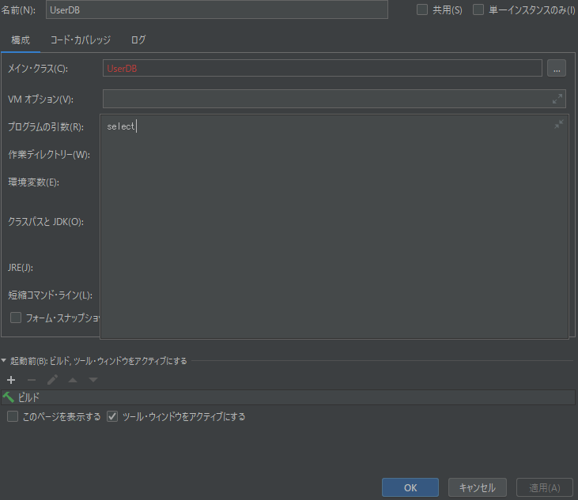

ブレイクポイントを置いたら、デバッグの実行

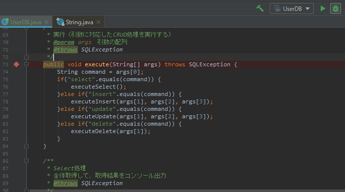

変数を確認できる

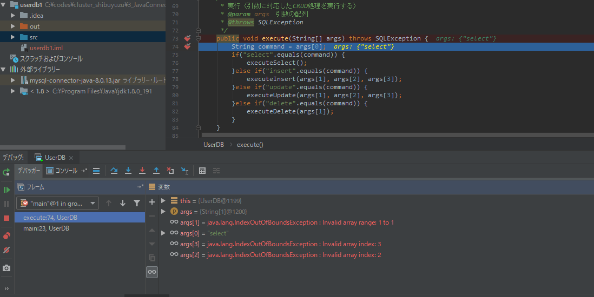

コンソール結果

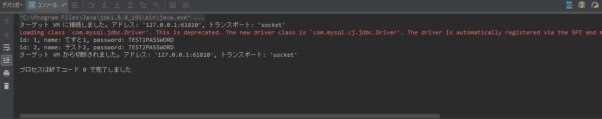

同じ要領で、insert、update、deleteも動作確認をしてください。

## 演習

[同じ要領でここの演習やってみて](http://si.comp.ae.keio.ac.jp/web_app_dev_material/simple/dev_db/dev_db_prac/index.html)
