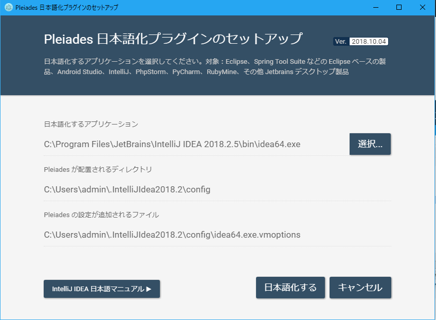

# 開発環境の整備
まずはじめに、演習をおこなうために必要な環境の整備をおこないます。

本教材では、Windows7もしくはWindows10がインストールされたPCを1台、開発用マシンとして使用します。

この開発用マシンに、開発に必要なツールをインストールして、WEBアプリケーション作成・動作確認をおこないます。

####  サーバーソフトウェアのインストール
まずはじめに、開発用PCにサーバソフトウェアをインストールします。

##### サーバソフトウェアの概要
サーバソフトウェアとは、サーバマシン上で動作し、ネットワークを介してクライアントに各種サービスを提供するソフトウェアです。

今回の演習では、開発用PCに以下のサーバソフトウェアをインストールします。

以下のリンクよりXAMPPをダウンロードして、インストールしてください。

* **[XAMPP](https://www.apachefriends.org/jp/index.html)**
    * Apache （Webサーバ）
    * Tomcat （サーブレットコンテナ）
    * MySQL  （SQLデータベー）
  
XAMPPとは、Webアプリケーション開発に欠かすことのできないソフトウェアを**一括インストールすることができる**パッケージのことです。

###### 動作確認
Apache,MySQLを起動

MySQLのAdminボタンを押下して、PHPMyAdminが起動されることを確認します。

####  IntelliJ IDEAのインストール
本演習では、Javaソースコードの作成、コンパイル、 Tomcatへの配備などの一連の操作をすべてIntelliJ IDEAを利用しておこないます。 

IntelliJ IDEAはJavaプログラム開発に対応したIDE(統合開発環境)です。 
Javaソースコードの記述からコンパイル・実行までをグラフィカルなインタフェースを介しておこなうことができます。 

2016年時点ではJavaの統合開発環境としては1番人気です。

下記サイトより、IntelliJ IDEAのCommunity版をダウンロードして、インストールしてください。
**[IntelliJ IDEA](https://www.jetbrains.com/idea/)**

##### 日本語化
下記サイトより、日本語化のプラグイン（Windows版）をダウンロード
[Pleiades](http://mergedoc.osdn.jp/)

zipファイルを解凍して、中のSetUpを起動

対象のIntelliJを選択

日本語化するボタンを押下し、終了
